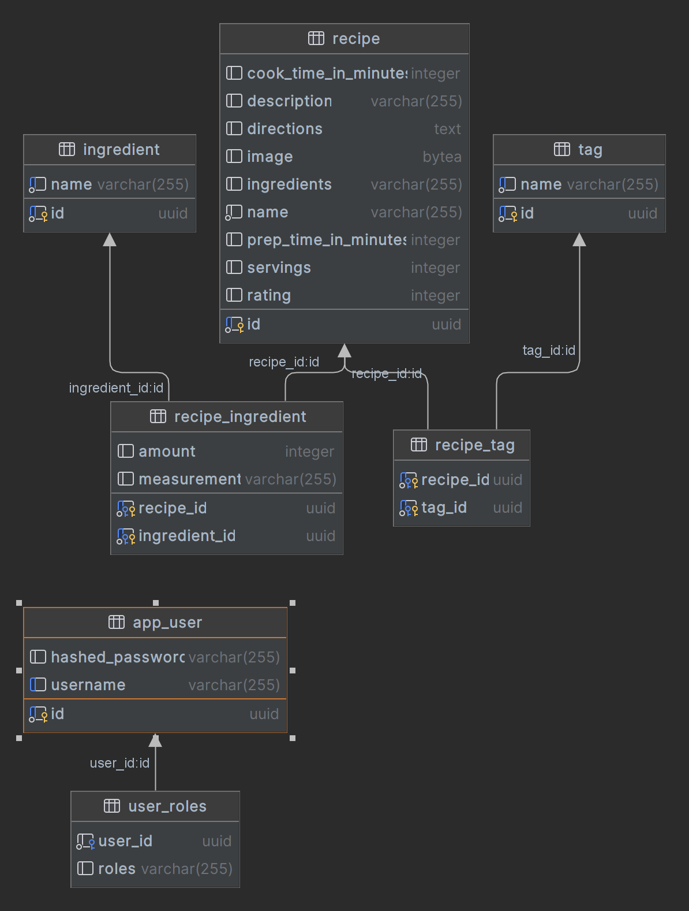

# RecipeDB Backend

The project is part of the semester work from the subject NNPIA.

[Frontend README](./frontend/)

## Running the application with Maven

The project is a standard Maven project. To run it from the command line,
type `mvnw`, then open http://localhost:8080 in your browser.

## Deploying to Production

To create a production build, call `mvnw clean package -Pproduction`.
This will build a JAR file with all the dependencies and front-end resources,
ready to be deployed. The file can be found in the `target` folder after the build completes.

Once the JAR file is built, you can run it using `java -jar target/nnpia-semestralka-1.0-SNAPSHOT.jar`.

## Database model

## Project structure
<table style="width:100%; text-align: left;">
  <tr><th>Directory</th><th>Description</th></tr>
  <tr><td><code>frontend/</code></td><td>Client-side source directory</td></tr>
  <tr><td><code>src/main/java/cz.klecansky.recipedb/</code></td><td>Server-side 
source directory, contains the server-side Java views</td></tr>
</table>