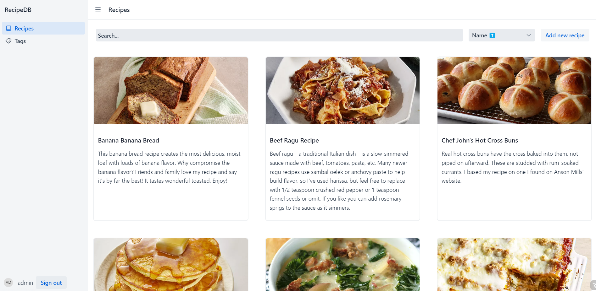

# RecipeDB

Simple recipe application for storing recipes. The main purpose of this application is as a semester project for course of programming web application with Spring. The secondary purpose was to test [Hilla](https://hilla.dev/) framework.

## Description

As mentioned, this is a recipe management application. It is not a groundbreaking application but it is big enough to test how the Hilla framework works.

### Features

- Recipe management
- Tags
- Simple search with filter
- Authentication
- Pagination

### Built with

#### Backend

- Java
- Spring
- Hilla
- Postgres

#### Frontend

- React
- Vaadin React Components

## Running the application with Maven

The project is a standard Maven project. To run it from the command line,
type `mvnw`, then open http://localhost:8080 in your browser. But you have to have running Postgres database with default parameters specified in applications.properties or set custom enviroment variables: DB_URL, DB_USERNAME, DB_PASSWORD

## Deploying

To create a production build, call `mvnw clean package -Pproduction`.
This will build a JAR file with all the dependencies and front-end resources,
ready to be deployed. The file can be found in the `target` folder after the build completes.

Once the JAR file is built, you can run it using `java -jar target/nnpia-semestralka-1.0-SNAPSHOT.jar`.

## Video

https://github.com/pavelklecansky/NNPIA-Semestralka/assets/28779692/bbd991f0-cf93-4a22-8236-47a7b6d0f892
