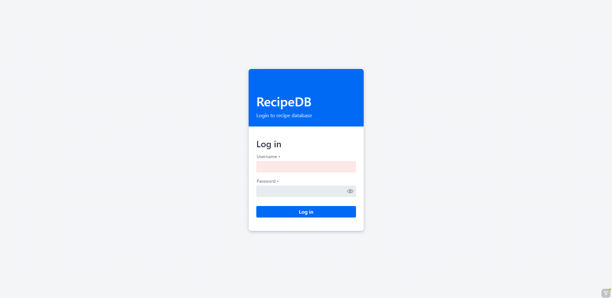
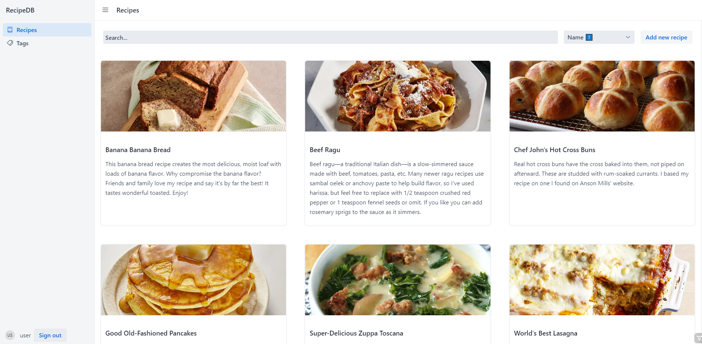
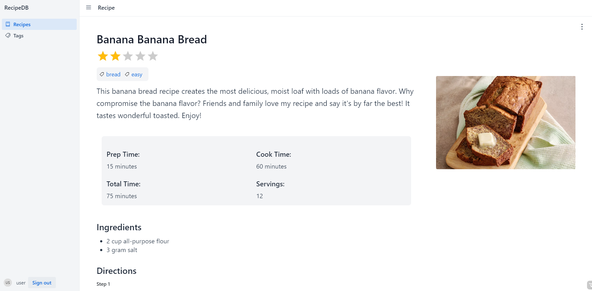
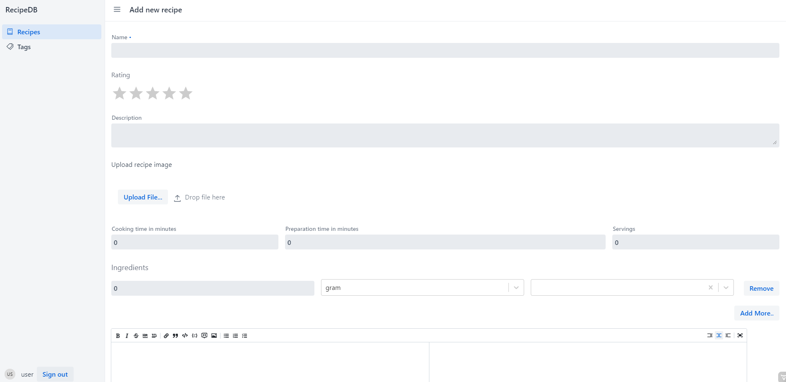
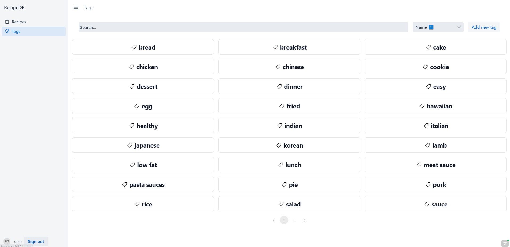
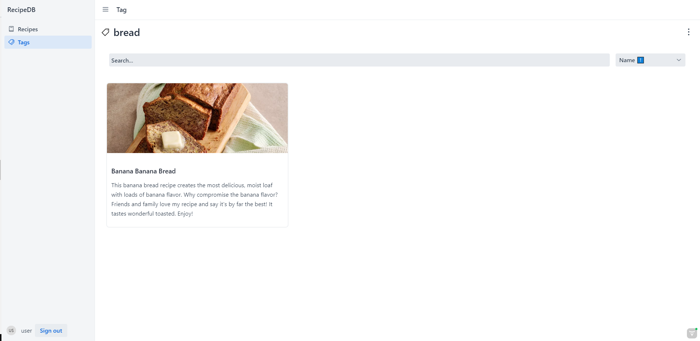

# RecipeDB Frontend
The project is part of the semester work from the subject NNPIA.
## Running the frontend
Frontend is part of backend, so it is automatically run when you run you backend
application.

## UI
### Login

### Recipes

### Recipe

### New Recipe

### Tags

### Tag view

